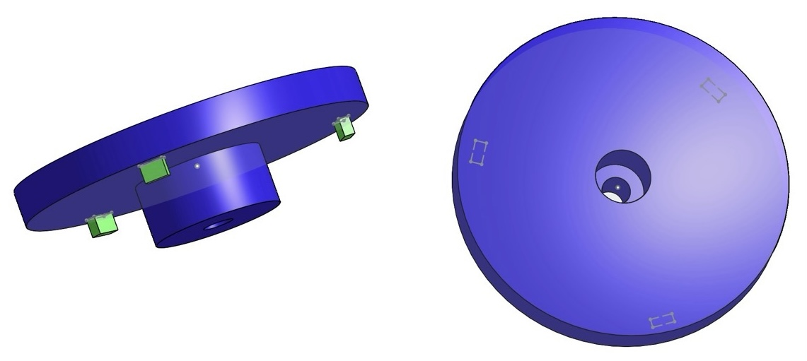
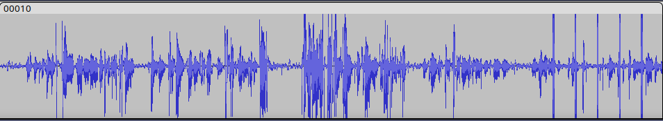
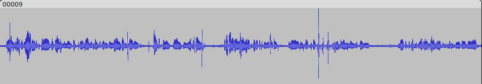
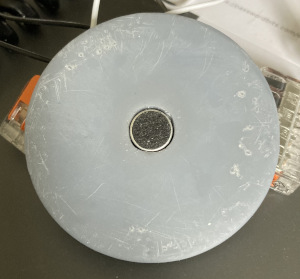
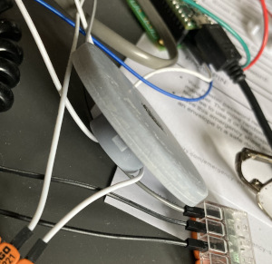
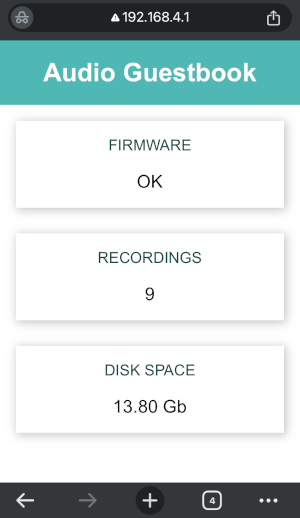
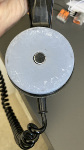

# Audio Guestbook Journal

This journal will be a log/diary of the audio guestbook journey.

An audio guestbook is a unique and fun way to capture audio messages from guests during an event, it this case an upcoming wedding.

Plan: Use an old GPO rotary telephone (containing new electronics) that guests can leave messages on for the bride and groom to hear later and have as a memory of the day.

### January

Ordered a Teensy 4.1 embedded development board and a Teensy 4.0 audio board for the audio processing of the messages.
 
Soldered headers and pins to the two boards so they can be connected together.

Set up the development environment (linux development mini PC), using VSCode and the PlatformIO extension. All code available in it’s own [github repository](https://github.com/m0wmt/audio-guestbook). Created a ‘blink’ program to prove that it all works as expected.

### February

Rotary Telephone:


Won an eBay auction for a GPO No. 760 rotary telephone. In very good condition, rotary dial works perfectly bringing back nostalgic memories and it has an additional PRESS button.

Started writing test code to confirm soldering was okay and that we can access the SD card on the Teensy (main board) and play WAV files via the Teensy audio board, all working as expected.

Took the phone to pieces; removed the two screws on the top where the handset rests and pulled the top off.  Identified all the wires; microphone, speaker, handset rocker switch, and the PRESS button switch.

> Speaker: 			Green == 2 (-ve GND) 		Red == 1 (+ve TIP)
> 
> Microphone: 		Blue == 3 (-ve GND) 		White == 10 (+ve MIC)
> 
> Handset Switch: 	5 (-ve GND)				   17 (+ve)
> 
> PRESS Button: 	Brown == 13 (-ve GND)	 	Blue == 12 (+ve)


Phone speaker connected to Teensy Audio Board:


Found a spare 3.5mm headphone, stripped it of it’s existing wiring and re-wired with 2 wires, one at the tip (red/+ve) and one on the sleeve (green/GND). Plugged it in to the audio board headphone socket and tested, can now hear music from the telephone handset via code.


Phone connection panel:


Identified and tested the handset switch and PRESS button actions.  Can now detect PRESS button being pressed/released and handset rocker switch when the handset is lifted/put back down. Using pins 40 and 41 on the Teensy for the two switches, 41 for the handset and 40 for the PRESS button.
Wiring of the telephone; Handset lever, Teensy GND to terminal 5 (T5) on the handset, +VE (Teensy pin 41) to T17 on the handset. PRESS button, Teensy GND to T13, +VE to (Teensy pin 40) T12.

Can play a .WAV file but not a beep via code!  Checking the pins I'd soldered it looks as though I haven't soldered the VOLUME pin for the audio board, added extra pins to the Teensy board so that all pins are connected to the audio board.  Switched everything back on and got the red LED blinking at me :-(. Not sure what I've done wrong, blinks 9 times which apparently can have something to do with onboard memory, bottom of this page has a [list of blink error codes](https://www.pjrc.com/store/ic_mkl02_t4.html).  There's also a list of known problems available [here](https://www.pjrc.com/teensy/troubleshoot.html).  One way to attempt a fix apparently is press the load button for 15 seconds and then release, this should cause the chip to reset (red LED will be on whilst this happens, can take about 40 seconds) and reload the blink program.  Tried this a few times and eventually got it to work, orange LED is blinking every 500ms, next test will be a simple prgram just in case it's the beep code I was trying out caused the issue. If one exists you can view the crash report by;
```
void setup() {
    while(!Serial) {
    }
    if (CrashReport)
        Serial.print(CrashReport);
}
```

Connected a new 3.3v button battery to the RTC ([VBAT + GND](https://www.pjrc.com/teensy/card11b_rev4_web.pdf) next to the SD card on the Teensy) today (7th Feb) and wrote a test program to set and read the RTC.  All seems to work, will leave the battery connected and test to see how long it lasts, according to the [PRJC Teensy forum](https://forum.pjrc.com/index.php) about 1-2 months for the Teensy 4.

Finally fixed the issue with no beep from the speaker, wasn't initalising the mixer section properly, RTFM!  Added RTC code to main program.

Not getting any voice when trying to record, not getting anything to record, just writing out the header!

Fixed the recording issue, hadn't connected an audio input (from the microphone) stream to the output queue (in code), had connected the speaker by mistake to the queue!  Testing micGain(40) values for the recordings, haven't decided on the best value yet. Replaying the .wav files in Audacity gives a good visual indication of how much gain is too much. Have ordered some electret microphones to see if they are better than the telephones original one, should be an easy swap if they're better.

Electret microphones have arrived (via eBay for a couple of quid) and seem to give a cleaner voice recording, though this will need to be tested in the phone handset to confirm at some point.

Tidy up code a bit and start to document functions. Modified AUDIO_BLOCK_SAMPLES to 256 in /home/#########/.platformio/packages/framework-arduinoteensy/cores/teensy4/AudioStream.h as suggested by the audio guestbook post on the PRJC forum. Did a full clean and rebuild of project and changes are picked up - as this will probably be the only Teensy audio project I do changing the library is fine for now.

Now working on phone handset logic and coding standards, attempting to keep as close to the [Barr Group](https://barrgroup.com/sites/default/files/barr_c_coding_standard_2018.pdf) coding standards as I'm happy with.  For a bit of fun added morse code for error sounds, that way will be able to understand what the error is as we won't be able to see the Teensy LED with the phone back together. Will worry about PRESS button and dialer after happy with this logic.

Now have a wiring diagram of all the connections thanks to my [wife](https://www.redbubble.com/people/quirkytales/shop?artistUserName=quirkytales&collections=1925754&iaCode=all-departments&sortOrder=relevant) who is a digital artist amongst other talents.

Have decided to write a test button (button-test) program to work out the handset and press button logic, less to worry about with recording etc. Have seen a variety of ideas on the Teensy forum which I want to try out/test. Button-test project now created (14th Feb) within the audio-guestbook project, updated the platformio.ini file so that I can easily compile either project inside VSCode. Have already found a logic error and expect to find others.

Modified logic, using less switch options in the main loop and removed looking at buttons during the wait() function. Need to sort out too long recordings (need to confirm how long a message may be), not erroring for some reason, had to stop for the day before I could fix it.

Still working on recording logic/errors but for a bit of variety I decided to model a microphone housing for the electret microphone to replace the telephones original microphone. This is my first proper attempt at 3D modelling and I used [Onshape](https://www.onshape.com/en/) because it can be used on a variety of platforms and is free for hobbyists. First rendition looks good, now need to wait for my 3D print manufacturer to print it. An .stl of the model is available in the notes directory of this repository, I will put it on [thingiverse](https://www.thingiverse.com/) once I'm happy with it. TODO: ADD THINGIVERSE LINK TO .STL

3D model of replacement microphone: 

Have too long recording sorted. Sound a tick every second for the last 15 seconds and then end the recording. Will need a leaflet letting people know how long they can have to record a message. If phone is left off the hook for some reason morse code (SOS) will play via the handset speaker until the handset is replaced.

Think I have all the recording logic sorted now, just needs lots of testing to make sure!!  Have now copied relevant code from the button-test project to the main project. One issue I am having during testing is that when I play a beep to warn the user that their time is running out that appears on the recording as well - no idea why. Need to try the electret microphone plugged directly into the audio board and some headphones I have lying around to see if there is any crossover via the phone connections.

Might need to replace the handset rocker switch, seems very noisy or there are multiple connections on the phone causing noise issues or change pin connections so I don't go through the 'T' connection on the phone.

Did a test of the handset microphone vs the electret microphone and direct wiring without the telephone patch connections on the phone base. As you can see from the pictures below, the electret microphone has a clearer signal and with no wiring going through the phone connection plate no warning beeps appear in the last 'n' seconds of the extended recording.

Handset microphone and warning spikes near the end showing the warning beep also being recorded. 

Electret microphone; clearer audio, and no warning spike feedback recorded. 

Have now removed the handset connections (all 4) from the 'T' connector on the telephone motherboard and soldered/wired them directly to the Teensy Audioboard for hopefully clearer sound/voice recording. Waiting on 3D model of the microphone before I swap the original out for the Electret one.

Now just a case of more testing to see what errors I can generate and think about how to power the telephone/Teensy etc. if there isn't a power socket available. Need to run a test on how much power it uses for say 12 hours.

Testing going well, for something different going to move to admin monitor program.

Using an ESP32-S3 mini MCU may not be the best, having issues with Linux and USB after writing firmware with this board. Need to remove the USB cable and re-attach it then run the serial monitor to get access to the serial output. For some reason the board isn't rebooting after the upload, or if it is the monitor isn't seeing it! Other than that the wi-fi access point works, just need to design the web page I'll be displaying, have a few ideas. It will be a view only program, don't want any chance of someone cocking up the Teensy by sending a message to it. 

3D model for microphone placement arrived, was resin printed. I didn't quite get the location of the tabs at the bottom far enough out to stop it rotating, once it's in position I'll decide if this is a problem or not. Microphone fits in nicely (after a tiny bit of fettling) in the model once I drilled the big hole out to 10mm. Had set it at 9.7mm (the size of the microphone) but tolerances were too tight! Need to update the model at some point, will try using OpenSCAD for a change.

 

Spent some time on the guestbook monitor program today, takes longer than you think to create an access point web page! Now have a web page via the ESP32 which updates every 30 seconds (currently) giving you and overview of the firmware status, number of recordings and disk space left on the SD card.



Need to work now on connecting the Teensy and ESP32 so that the Teensy can update the ESP32 (if it's connected/running) with it's status, disk space and number of recordings. Might add other information but that's the minimum I want for now.

Had a thought about the venue not having mains power available where the phone will be, instead of wi-fi for the monitor program can I use BLE, the answer is yes. Will have to host the web page to view the status of everything on github pages - so I don't corrupt my current repository I will be making a new repository for the monitor web page, once I've done this I'll update this journal with the location. No idea if I'll use this or the wi-fi or if it'll work but worth a try and I'll learn something new!

Trying out a new 3D modeling tool - Tinkercad - which can be run on an iPad. Not as powerful as OnShape or computer based 3D packages but for what I need here works just fine. A new .stl file is available in the notes directory (helpfully named tinkercad in the file name!). Yet to be printed so no idea if it's more accurate than the first model but it's there for later testing.

Been a little while - took a break as the weather has been nice!.  Yesterday (15/4/25) I replaced the original microphone with the electret microphone in the phone, soldered in place but can be removed and the original put back in if ever needed. Recordings are good so that's another step closer and the 10 second warning beeps are effectively gone - <audio controls src="./audio/output.wav"></audio> <a href="./audio/output.wav"> example sound file</a>.



Created new admin monitor program for low energy bluetooth, can read the test values on my phone using the nRF Connect app available on the Android/iPhone stores.

Been a while but starting to work now on the admin monitor. Using serial8 on the Teensy (pin 34/35) as the other pins are being used/obscured by the audio board.  The monitor will only receive information from the teensy, it will not be able to transmit to it as I don't want anyone messing with the guestbook.

Eventually had some time to work on the admin monitor.  Now that we have batteries available (2 x 24v from an electric buggy) I am going to concentrate on the wi-fi option for
the admin application as I like the view I can show on my phone.  Will need to test at some point how far wi-fi will reach from an ESP32. 

Wi-fi version now working. Sending data from the Teensy via Serial8 to the ESP32 and then displaying the information on the web page that the ESP32 is publishing.  Could do more on it but it's working so happy for now.

Haven't been able to upload to the Teensy reliably since a Linux (Mint) update so started up the Windows laptop and worked on there for the Teensy part.  Not sure if it was the update that stopped it working (USB issues) but spent too much time trying to get it to work so went the easy route for now.

### Development Tasks:
* Play .WAV file through handset speaker - Done.
* Identify handset and PRESS button connections on the phone and detect states on Teensy - Done.
* RTC using a button battery - Done.
* Record message via handset speaker.  Need to wait for right angle connectors to arrive before doing the MIC, only way to test that will be to speak in to it! - Partially done.
* Play sound when program starts up - Done.
* Play message to user to record after the beep = Partially done.
* Download Audacity to the PC for recording WAV files and playing them back - Done and tested.
* Program startup logic, handset not on phone, no SD card etc. No SD card done.
* Program logic of handset/PRESS button - In progress.
* Handle possible errors.
* Can we use the telephone dial to carry out actions?
* Use [Barr Group](https://barrgroup.com/sites/default/files/barr_c_coding_standard_2018.pdf) C coding standards - In progress.
* Replace original microphone with an electret one. Waiting on manufacture of the replacement microphone housing - request sent to 3D offsite manufacturer.
