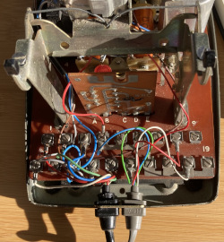

# Audio Guestbook Journal

This journal will be a log/diary of the audio guestbook journey.

An audio guestbook is a unique and fun way to capture audio messages from guests during an event, it this case an upcoming wedding.

Plan: Use an old GPO rotary telephone (containing new electronics) that guests can leave messages on for the bride and groom to hear later and have as a memory of the day.

### January

Ordered a Teensy 4.1 embedded development board and a Teensy 4.0 audio board for the audio processing of the messages.
 
Soldered headers and pins to the two boards so they can be connected together.

Set up the development environment (linux development mini PC), using VSCode and the PlatformIO extension. All code available in it’s own [github repository](https://github.com/m0wmt/audio-guestbook). Created a ‘blink’ program to prove that it all works as expected.

### February

Rotary Telephone:


Won an eBay auction for a GPO No. 760 rotary telephone. In very good condition, rotary dial works perfectly bringing back nostalgic memories and it has an additional PRESS button.

Started writing test code to confirm soldering was okay and that we can access the SD card on the Teensy (main board) and play WAV files via the audio board, all working as expected.

Took the phone to pieces; removed the two screws on the top where the handset rests and pulled the top off.  Identified all the wires; microphone, speaker, handset rocker switch, and the PRESS button switch.

> Speaker: 			Green == 2 (-ve GND) 		Red == 1 (+ve TIP)
> 
> Microphone: 		Blue == 13 (-ve GND) 		White == 10 (+ve MIC)
> 
> Handset Switch: 	5 (-ve GND)				   17 (+ve)
> 
> PRESS Button: 	Brown == 13 (-ve GND)	 	Blue == 12 (+ve)


Phone speaker connected to Teensy Audio Board:


Found a spare 3.5mm headphone, stripped it of it’s existing wiring and re-wired with 2 wires, one at the tip (red/+ve) and one on the sleeve (green/GND). Plugged it in to the audio board headphone socket and tested, can now hear music from the telephone handset via code.


Phone connection panel:


Identified and tested the handset switch and PRESS button actions.  Can now detect PRESS button being pressed/released and handset rocker switch when the handset is lifted/put back down. Using pins 33 and 34 on the Teensy for the two switches, 33 for the handset and 34 for the PRESS button.
Wiring of the telephone; Handset lever, Teensy GND to terminal 5 (T5) on the handset, +VE (Teensy pin 33) to T17 on the handset. PRESS button, Teensy GND to T13, +VE to (Teensy pin 34) T12.

Can play a .WAV file but not a beep via code!  Checking the pins I'd soldered it looks as though I haven't soldered the VOLUME pin for the audio board, added extra pins to the Teensy board so that all pins are connected to the audio board.  Switched everything back on and got the red LED blinking at me :-(. Not sure what I've done wrong, blinks 9 times which apparently can have something to do with onboard memory, bottom of this page has a [list of blink error codes](https://www.pjrc.com/store/ic_mkl02_t4.html).  There's also a list of known problems available [here](https://www.pjrc.com/teensy/troubleshoot.html).  One way to attempt a fix apparently is press the load button for 15 seconds and then release, this should cause the chip to reset (red LED will be on whilst this happens, can take about 40 seconds) and reload the blink program.  Tried this a few times and eventually got it to work, orange LED is blinking every 500ms, next test will be a simple prgram just in case it's the beep code I was trying out caused the issue. If one exists you can view the crash report by;
```
while(!Serial) ;
if (CrashReport)
   Serial.print(CrashReport);
```

Todo: 
* RTC using button battery, might need to be a separate program.
* Play sound when program starts up.
* Play message to user to record after the beep.
* Need to wait for right angle connectors to arrive before doing the MIC, only way to test that will be to speak in to it!
* Download Audacity to the PC for recording WAV files and playing them back.
* Program logic of handset/PRESS button.
* Can we use the telephone dial to carry out actions?
