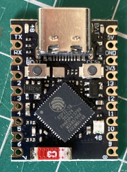

# audio-guestbook
Audio guestbook for an upcoming wedding.  Let guests leave a message so the bride and groom can relive the day and hear what their loved ones/friends had to say via an old BT rotary telephone (using a Teensy development board and a Teensy Audio board) to record messages to a micro SD card.

This project is an update (VSCode + Platformio vs Arduino IDE) of the audio guestbook project by [Playful Technology](https://github.com/playfultechnology/audio-guestbook).

## Requirements
- Power switch to turn recorder on/off
- Start recording when handset is lifted
- Stop recording when handset is replaced
- Light to indicate when recording
- Maximum recording length of 'n' minutes
- Stop recording after set time, play time exceeded .wav file
- Deal with handset not being put back correctly (see exceed recording length)
- Light to inidicate errors (different colours for different errors)
- Play recorded message to tell user 'to leave their message after the beep'
- Get recorded message(s) from customer (start recording, exceeding time limit, and contact support)
- Button to replay last message
- Save recorded messages as .wav files to micro SD card
- Indicate how many messages have been recorded (to be defined)
- Power recorder by USB phone charger or battery
- Web page showing status (number of recordings, disk usage etc.) to support user. This will utilize an ESP32 with a Wi-Fi access point, with messages sent via Serial/UART from the Teensy to the ESP32 for displaying.

## Parts List
- Rotary telephone [how to dismantle GPO No. 706 Rotary Phone](https://www.britishtelephones.com/t706dismantle.htm)
- Teensy 4.1 [development board](https://www.pjrc.com/teensy/pinout.html)
- Teensy 4.0 [audio board](https://www.pjrc.com/store/teensy3_audio.html)
- Mico SD card (7.2Gb for 24hrs @ 44.1kHz)
- LED light(s)
- Switch
- ESP32-S3 Mini

<figure>
  
  <figcaption>Teensy 4.1</figcaption>
</figure>

<figure>
  
  <figcaption>Teensy Audio Board 4.0</figcaption>
</figure>

<figure>
  
  <figcaption>ESP32-S3 Mini</figcaption>
</figure>

<figure>
  
  <figcaption>GPO No. 706 Rotary Phone</figcaption>
</figure>

<figure>
  
  <figcaption>Phone terminal connections</figcaption>
</figure>

## Wiring
Audio board connected to Teensy through corresponding pins.  Handset lever, GND to terminal 5 (T5) on the handset, +VE to T17 on the handset. PRESS button, GND to T13, +VE to T12.