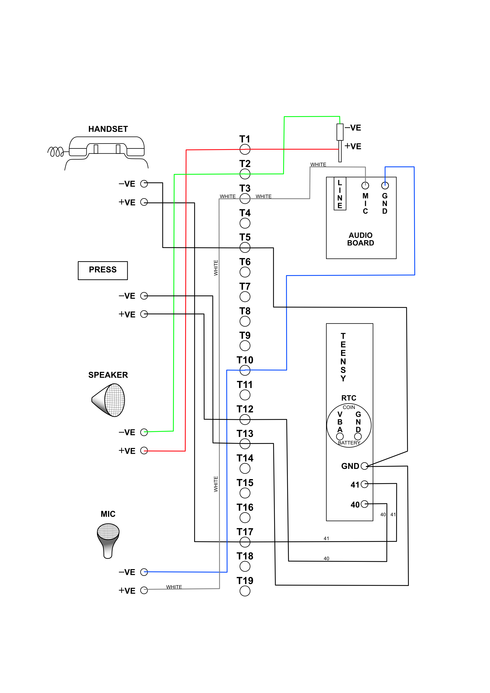

# audio-guestbook
Audio guestbook for an upcoming wedding.  Let guests leave a message so the bride and groom can relive the day and hear what their loved ones/friends had to say via an old BT rotary telephone (using a Teensy development board and a Teensy Audio board) to record messages to a micro SD card.

This project is an update (VSCode + PlatformIO VS Arduino IDE) of the audio guestbook project by [Playful Technology](https://github.com/playfultechnology/audio-guestbook).

## Technical 

### Code Editor
***VSCode using the following plugins:
  * PlatformIO
  * Clang-Format (code formatting) with a bespoke .clang-format file

### Audio Library
As mentioned in the JOURNAL, PRJC forum thread on the audio guestbook noted above we have increased the number of audio samples in an "audio block" from 128 to 256. This means that audio updates run every 5.8ms rather than the standard 2.9ms, with the consequence that an SD write can take nearly 12ms before an update is "lost".

## Requirements
- Power switch to turn recorder on/off
- Start recording when handset is lifted
- Stop recording when handset is replaced
- Light to indicate when recording?
- Maximum recording length of 'n' minutes
- Stop recording after set time, play time exceeded .wav file
- Deal with handset not being put back correctly (see exceed recording length)
- Light to inidicate errors (different colours for different errors)?
- Play recorded message to tell user 'to leave their message after the beep'
- Get recorded message(s) from customer (start recording, exceeding time limit, and contact support)
- Button to replay last message
- Save recorded messages as .wav files to micro SD card
- Indicate how many messages have been recorded (to be defined)
- Power recorder by USB phone charger or battery
- Web page showing status (number of recordings, disk usage etc.) to support user. This will utilize an ESP32 with a Wi-Fi access point, with messages sent via Serial/UART from the Teensy to the ESP32 for displaying. Due to power demand of the wi-fi this will only be available if we're using mains power.

## Parts List
- Rotary telephone [how to dismantle GPO No. 706 Rotary Phone](https://www.britishtelephones.com/t706dismantle.htm)
- Teensy 4.1 [development board](https://www.pjrc.com/teensy/pinout.html)
- Teensy 4.0 [audio board](https://www.pjrc.com/store/teensy3_audio.html)
- Mico SD card (7.2Gb for 24hrs @ 44.1kHz)
- LED light(s)?
- Switch
- ESP32-S3 Mini
- [Electret](https://en.wikipedia.org/wiki/Electret_microphone) microphone

<figure>
  <figcaption>Teensy 4.1</figcaption>
  
</figure>

<figure>
  <figcaption>Teensy Audio Board 4.0</figcaption>
  
</figure>

<figure>
  <figcaption>ESP32-S3 Mini</figcaption>
  
</figure>

<figure>
  <figcaption>GPO No. 706 Rotary Phone</figcaption>
  
</figure>

<figure>
  <figcaption>Phone terminal connections</figcaption>
  
</figure>

<figure>
  <figcaption>Electret Microphone</figcaption>
  
</figure>

## Coding Journal
See the [JOURNAL.md](JOURNAL.md) file for a blow-by-blow account of progress etc.

## Wiring
Teensy audio board is connected to the Teensy board through the corresponding pins.  Thank you to my [wife](https://www.redbubble.com/people/quirkytales/shop?artistUserName=quirkytales&collections=1925754&iaCode=all-departments&sortOrder=relevant) for providing the wiring diagram below.

<figure>
  
</figure>

